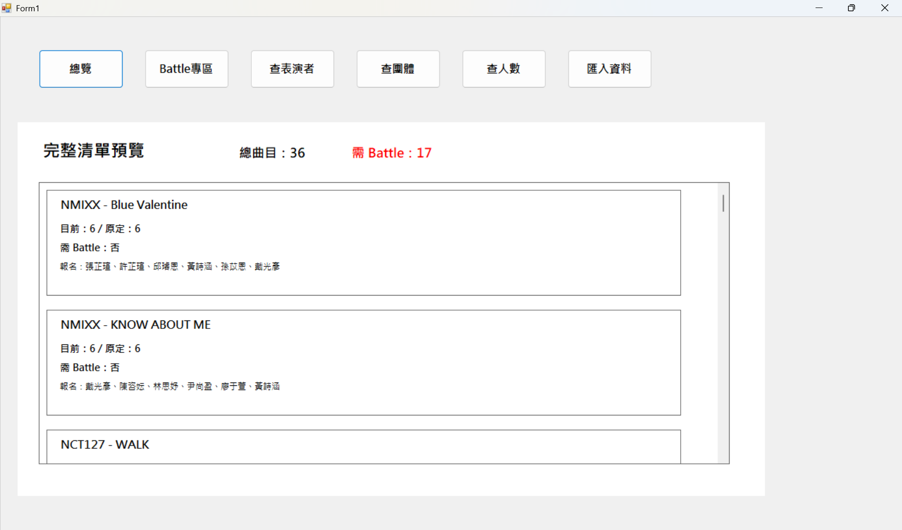
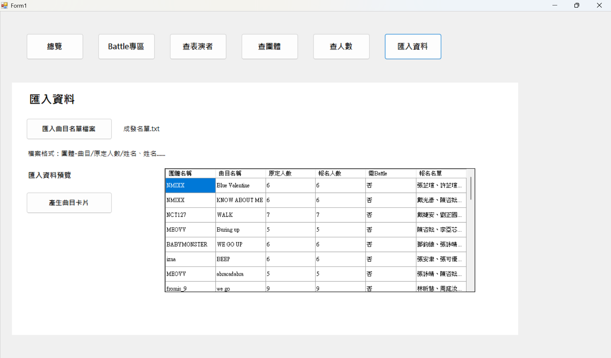
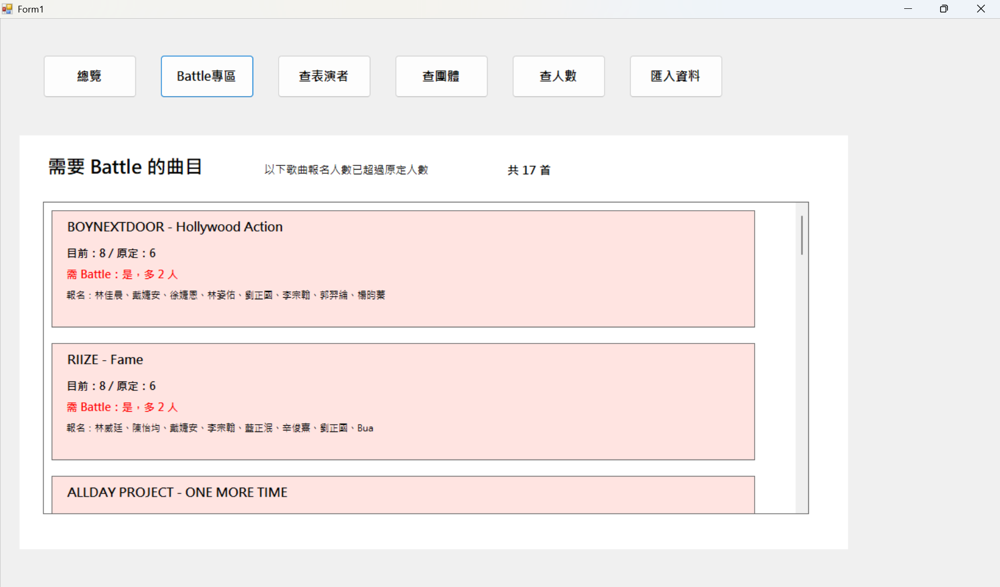
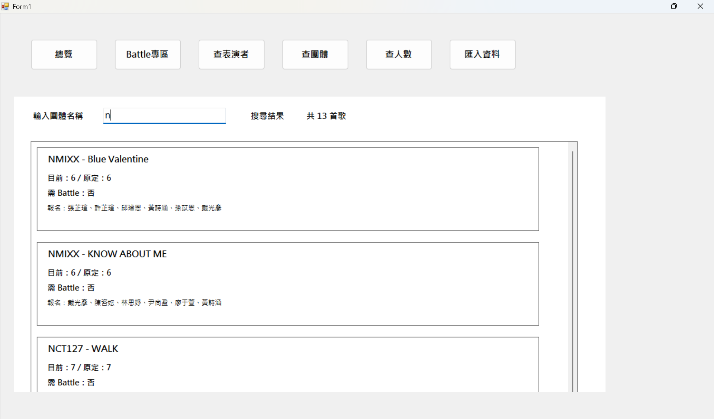
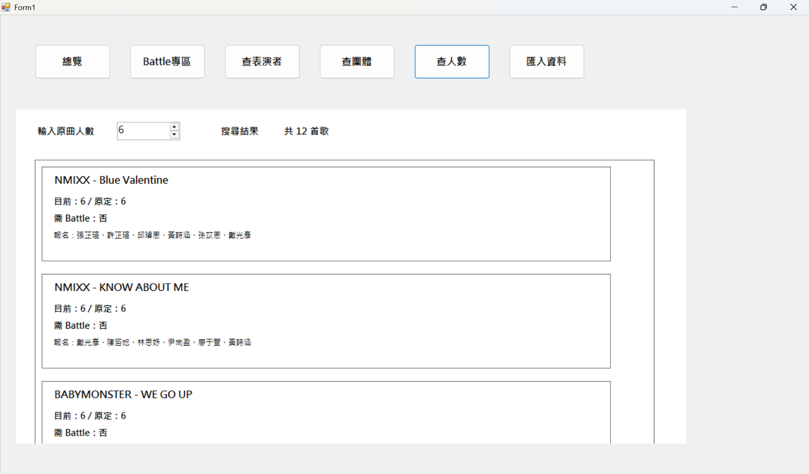

# 成發表演曲目管理系統

## 一、專案簡介

本專案為一個使用 **C# Windows Forms App (.NET Framework)** 製作的成發表演曲目管理系統。

系統主要用來管理成發表演的曲目資料，包含團體名稱、曲目名稱、原定人數、報名人員名單，以及是否需要 Battle。使用者可以匯入文字檔，系統會自動讀取資料並整理成清單，方便查看全部曲目、Battle 曲目、表演者報名曲目、團體曲目與指定人數曲目。

---

## 二、開發環境

* 開發工具：Visual Studio
* 專案類型：Windows Forms App (.NET Framework)
* 程式語言：C#
* 主要使用元件：

  * Button
  * Label
  * TextBox
  * NumericUpDown
  * Panel
  * FlowLayoutPanel
  * DataGridView
  * OpenFileDialog

---

## 三、系統功能

### 1. 匯入曲目名單檔案

使用者可以匯入 `.txt` 文字檔。
檔案內容會包含團體名稱、曲目名稱、原定人數與報名人員名單。

匯入後，系統會將資料顯示在預覽表格中，方便使用者確認資料是否正確。

---

### 2. 完整清單預覽

匯入資料後，系統可以在總覽頁顯示所有曲目。

每首曲目會顯示：

* 團體名稱
* 曲目名稱
* 目前報名人數
* 原定人數
* 是否需要 Battle
* 報名人員名單

---

### 3. Battle 專區

系統會自動判斷哪些曲目需要 Battle。

判斷方式為：

```text
目前報名人數 > 原定人數
```

例如某首歌原定人數為 6 人，但報名人數為 8 人，代表報名人數超過原定人數，因此需要 Battle。

Battle 專區會只列出需要 Battle 的曲目。

---

### 4. 查表演者

使用者可以輸入表演者姓名，系統會搜尋該表演者報名過的所有曲目。

查詢結果會顯示：

* 該表演者共報名幾首歌
* 該表演者報名的所有曲目清單

---

### 5. 查團體

使用者可以輸入團體名稱，例如 `BABYMONSTER`、`NMIXX`、`RIIZE` 等。

系統會列出該團體的所有表演曲目，並顯示總共有幾首歌。

---

### 6. 查人數

使用者可以輸入或選擇原定人數。

系統會列出所有原定人數符合該數字的曲目。

例如輸入 `6`，系統會列出所有原定人數為 6 人的曲目。

---

## 四、匯入檔案格式

匯入檔案需為 `.txt` 文字檔。

每一行代表一首曲目，格式如下：

```text
團體名稱-曲目名稱/原定人數/姓名、姓名、姓名
```

範例：

```text
NMIXX-Blue Valentine/6/張芷瑄、許芷瑄、邱璿恩、黃詩涵、孫苡恩、戴光彥
BABYMONSTER-WE GO UP/6/鄧鈞維、張詠晴、陳姿妘、陳彥榕、蕭德曦、陳靖宜
BOYNEXTDOOR-Hollywood Action/6/林佳晨、戴婕安、徐婕恩、林姿佑、劉正國、李宗翰、郭羿綸、楊昀蓁
RIIZE-Fame/6/林威廷、陳怡均、戴婕安、李宗翰、藍正泯、辛俊熹、劉正國、Bua
```

格式說明：

```text
NMIXX-Blue Valentine/6/張芷瑄、許芷瑄、邱璿恩
```

代表：

* 團體名稱：NMIXX
* 曲目名稱：Blue Valentine
* 原定人數：6
* 報名人員：張芷瑄、許芷瑄、邱璿恩

---

## 五、操作方式

### 步驟 1：啟動程式

使用 Visual Studio 開啟專案後，按下「開始」執行程式。

---

### 步驟 2：匯入資料

點選上方的「匯入資料」按鈕。
接著按下「匯入曲目名單檔案」，選擇準備好的 `.txt` 檔案。

---

### 步驟 3：確認匯入資料

匯入完成後，系統會在預覽表格中顯示曲目資料。

表格會顯示：

* 團體名稱
* 曲目名稱
* 原定人數
* 報名人數
* 是否需要 Battle
* 報名名單

---

### 步驟 4：產生曲目卡片

確認資料後，按下「產生曲目卡片」。
系統會切換到總覽頁，並顯示所有曲目資料。

---

### 步驟 5：使用查詢功能

上方按鈕功能如下：

| 按鈕        | 功能              |
| --------- | --------------- |
| 總覽        | 顯示所有曲目          |
| Battle 專區 | 顯示需要 Battle 的曲目 |
| 查表演者      | 輸入姓名查詢該表演者報名的曲目 |
| 查團體       | 輸入團體名稱查詢該團體的曲目  |
| 查人數       | 輸入原定人數查詢符合人數的曲目 |
| 匯入資料      | 回到匯入資料頁面        |

---

## 六、Battle 判斷範例

假設資料如下：

```text
BOYNEXTDOOR-Hollywood Action/6/林佳晨、戴婕安、徐婕恩、林姿佑、劉正國、李宗翰、郭羿綸、楊昀蓁
```

此曲目原定人數為 6 人。
但是報名人數共有 8 人。

因為：

```text
8 > 6
```

所以此曲目需要 Battle，且多出 2 人。

---

## 七、專案特色

* 操作簡單，適合成發活動使用。
* 可以快速匯入大量曲目資料。
* 可以自動統計總曲目數。
* 可以自動判斷需要 Battle 的曲目。
* 可以依照表演者姓名查詢報名曲目。
* 可以依照團體名稱查詢曲目。
* 可以依照原定人數篩選曲目。
* 使用卡片方式顯示曲目資料，方便閱讀。

---

## 八、專案目的

本專案的目的是協助成發活動整理表演曲目與報名人員資料。

如果使用人工方式整理資料，容易發生漏看、算錯人數或找不到資料的情況。透過本系統，可以快速匯入資料並自動統計，讓負責人更容易掌握每首曲目的報名狀況，也能快速找出需要進行 Battle 的曲目。

---

## 九、注意事項

1. 匯入檔案必須是 `.txt` 文字檔。
2. 每一首曲目需放在一行。
3. 團體名稱和曲目名稱之間要使用 `-`。
4. 曲目名稱、原定人數和報名名單之間要使用 `/`。
5. 人名之間建議使用頓號 `、` 分隔。
6. 若檔案格式錯誤，該筆資料可能無法正確匯入。

---

## 十、程式執行畫面截圖

以下為本系統的主要執行畫面截圖，可用來展示系統介面與功能操作結果。

1. 總覽頁面

此畫面顯示所有匯入的表演曲目，並統計總曲目數與需要 Battle 的曲目數。


2. 匯入資料頁面
此畫面可匯入曲目名單檔案，並顯示匯入後的資料預覽。


3. Battle 專區頁面
此畫面會列出報名人數超過原定人數的曲目，方便負責人確認哪些曲目需要進行 Battle。


4. 查表演者頁面
此畫面可輸入表演者姓名，查詢該表演者報名的所有曲目。


5. 查團體頁面
此畫面可輸入團體名稱，查詢該團體的所有表演曲目。


6. 查人數頁面
此畫面可依照原定人數篩選曲目，列出符合該人數的所有歌曲。


---

## 十一、結論

本系統完成了成發表演曲目管理的基本需求，包含匯入資料、顯示完整清單、Battle 判斷、查表演者、查團體與查人數等功能。

透過此系統，可以讓成發曲目管理更加清楚、快速，也能減少人工整理資料時產生的錯誤。
